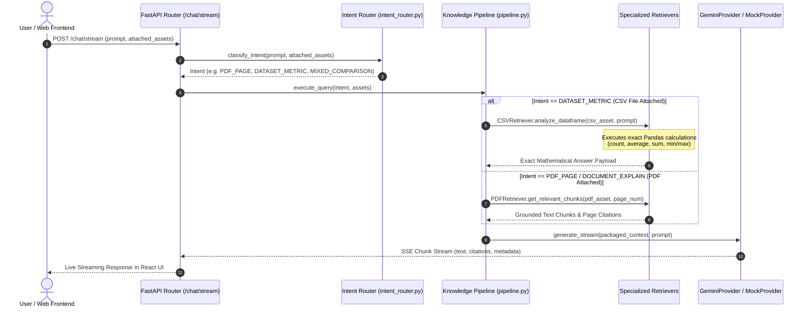

# NeuroDesk AI — AI Features & Hybrid RAG Architecture

## Overview

NeuroDesk AI combines **Grounded Document Reasoning (PDF RAG)**, **Exact Mathematical CSV Analytics (Pandas Engine)**, and **Multi-Provider LLM Orchestration (Gemini + Mock)** to provide enterprise-grade workspace intelligence.

---

## 1. The Intent-Aware Hybrid RAG Lifecycle



---

## 2. Intent Router Classification (`intent_router.py`)

The `IntentRouter` evaluates user prompts and attached workspace assets to select the optimal retrieval path:

| Intent | Trigger Pattern Example | Target Engine / Retriever | Confidence |
| :--- | :--- | :--- | :---: |
| `PDF_PAGE` | *"Explain page 5"*, *"Summarize page 1"* | `PDFRetriever` (Filtered to page number) | 0.98 |
| `DOCUMENT_EXPLAIN` | *"Explain this PDF"*, *"Summarize this document"* | `PDFRetriever` | 0.95 |
| `DATASET_METRIC` | *"How many employees?"*, *"Average age"*, *"Top revenue"* | `CSVRetriever` (Pandas Engine) | 0.95 |
| `MIXED_COMPARISON` | *"Compare PDF spec with CSV dataset"* (Both attached) | `PDFRetriever` + `CSVRetriever` | 0.92 |
| `IMAGE_METADATA` | *"Describe image metadata"* | `ImageMetadataRetriever` | 0.90 |
| `GENERAL_QUERY` | *"What is NeuroDesk AI?"* (No assets attached) | General LLM Knowledge | 0.40 |

---

## 3. Grounded PDF RAG & Citation Formatting

### Page-Specific Isolation
When a user asks *"Explain page 1"*, `PDFRetriever` extracts text exclusively from page 1 of the attached PDF asset. It does NOT query or pull data from unrelated attached CSV files or background workspace documents.

### Citation Integrity
Grounded responses automatically format citations linking back to the source document and page number:
```markdown
According to the architecture specification, the platform utilizes micro-services for workflow execution.

### 📚 Grounded Source Citations
- **Architecture_Spec.pdf** (Page 1)
```

### Prompt & History Leakage Prevention
`pipeline.py` strips internal system instructions, conversation headers (`Conversation History:`, `User Question:`, `Assistant:`, `Context Assessment:`), and raw file paths before presenting answers to the user.

---

## 4. Exact Pandas CSV Analytics Engine

### Why LLM Arithmetic is Avoided
LLMs frequently hallucinate numerical calculations when aggregating large datasets (e.g. computing average salary across 5,000 rows). NeuroDesk AI routes all structured CSV queries to `CSVRetriever` which runs Python **Pandas** dataframe queries directly:

- **Row Count**: `len(df)`
- **Average Metric**: `df[column].mean()`
- **Distribution**: `df[column].value_counts()`
- **Missing Values**: `df.isnull().sum()`
- **Top / Lowest Values**: `df.nlargest()`, `df.nsmallest()`

---

## 5. Gemini Provider & Fallback Engine

- **Primary Provider**: `GeminiProvider` uses the official `@google/genai` Python SDK (`gemini-2.5-flash`).
- **Graceful Fallback**: If `GOOGLE_API_KEY` is omitted, invalid, or times out, the system automatically falls back to `MockProvider` without throwing unhandled HTTP 500 exceptions.
