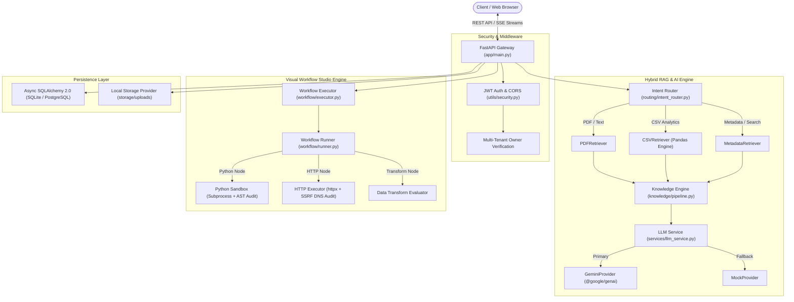

# NeuroDesk AI — System Architecture & Design Specification

## Overview

NeuroDesk AI is built as a decoupled full-stack enterprise platform featuring a FastAPI backend and a modern React + Vite frontend interface.

---

## 1. High-Level System Architecture Diagram

---

## 2. Core Backend Modules Specification

### 2.1 API Routers (`app/routers/`)
- `auth.py`: Registration, JWT login, token refresh, current user profile.
- `assets.py`: Asset upload, file parsing, metadata extraction, listing, download, deletion.
- `workspace.py`: Workspace summary metrics, asset statistics.
- `chat.py`: SSE streaming chat endpoint (`POST /chat/stream`), conversation management, message history, feedback.
- `workflow.py`: Workflow CRUD (`POST /workflows`, `GET /workflows`, `PUT /workflows/{id}`, `DELETE /workflows/{id}`), execution trigger (`POST /workflows/{id}/run`), cancel execution, JSON import/export.
- `project_generator.py`: Project blueprint generation, tech stack recommendation, risk assessment.
- `ai_studio.py`: AI model playground presets and prompt testing.
- `search.py`, `discovery.py`, `knowledge.py`, `analysis.py`: Domain search, asset discovery, and direct document analysis.

### 2.2 Domain Services (`app/services/`)
- `llm_service.py`: Provider factory, fallback routing, non-streaming & streaming generation.
- `chat_service.py`: Conversation history management, context packaging, token tracking.
- `workflow_service.py`: Workflow validation, version creation, DAG execution orchestration.
- `asset_service.py`: File storage, checksum calculation, MIME type validation.
- `knowledge_service.py`: Multi-asset index management and query routing.

### 2.3 RAG & Knowledge Engine (`app/core/knowledge/`)
- `intent_router.py`: Intent classifier returning `PDF_PAGE`, `DATASET_METRIC`, `GENERAL_QUERY`, `MIXED_COMPARISON`, `IMAGE_METADATA` with confidence score.
- `retrievers.py`:
  - `PDFRetriever`: Page-specific text extraction, chunking, grounded citation generation.
  - `CSVRetriever`: Pandas dataframe execution for exact mathematical queries (`count`, `average`, `distribution`, `missing_values`, `min_max`).
  - `ExcelRetriever`, `MetadataRetriever`, `SearchRetriever`, `ImageMetadataRetriever`.
- `pipeline.py`: Packages context, deduplicates citations, prevents system prompt leakage.

### 2.4 LLM Providers (`app/core/llm/`)
- `gemini_provider.py`: Official `@google/genai` Client integration supporting multimodal input, SSE streaming, system instructions, and automatic `MockProvider` fallback on timeout/missing key.
- `mock_provider.py`: Fallback engine ensuring 100% operational availability during offline development.

### 2.5 Workflow Studio Engine (`app/core/workflow/`)
- `python_sandbox.py`: Isolated subprocess executor (`asyncio.create_subprocess_exec`) with AST security auditor (`ASTSecurityVisitor`), secret environment stripping, and 5.0s timeout limit.
- `http_executor.py`: SSRF-safe HTTP request executor with DNS resolution (`socket.getaddrinfo`), loopback/private subnet blocklists, and 2 MB response limits.
- `data_transform.py`: Rule-based transform evaluator (`extract`, `filter`, `select`, `rename`, `sort`, `format`, `regex_extract`, `aggregate`) without using `eval()`.
- `executor.py` & `runner.py`: Topological DAG executor with active conditional branch routing (`true`/`false`), status `SKIPPED` assignment, exponential backoff retries, and variable interpolation.

---

## 3. Database Schema & Models (`app/models/`)

### Key Tables
- `users`: `id`, `email`, `password_hash`, `full_name`, `role`, `is_active`, `created_at`.
- `assets`: `id`, `owner_id`, `name`, `original_filename`, `asset_type`, `mime_type`, `file_size`, `storage_path`, `checksum`.
- `asset_metadata`: `id`, `asset_id`, `metadata_key`, `metadata_value`, `value_type`.
- `conversations`: `id`, `owner_id`, `title`, `summary`, `message_count`, `total_token_usage`, `is_pinned`, `is_favorite`.
- `chat_messages`: `id`, `conversation_id`, `role`, `content`, `markdown`, `attached_assets`, `retrieved_assets`, `latency_ms`.
- `workflows`: `id`, `owner_id`, `name`, `description`, `status`, `version`, `nodes_json`, `edges_json`, `variables_json`.
- `workflow_executions`: `id`, `workflow_id`, `owner_id`, `status`, `inputs_json`, `outputs_json`, `total_latency_ms`.
- `workflow_execution_nodes`: `id`, `execution_id`, `node_id`, `node_type`, `status`, `outputs_json`, `latency_ms`, `retry_count`.
- `execution_logs`: `id`, `execution_id`, `node_id`, `log_level`, `message`, `details_json`, `timestamp`.
